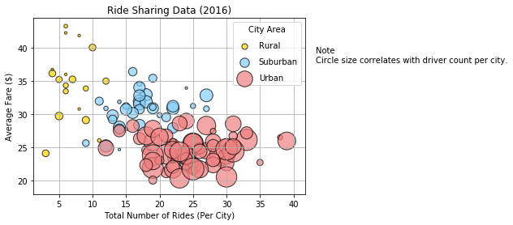
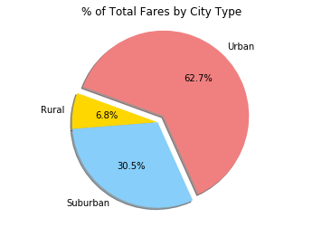
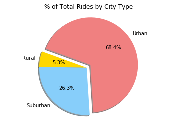
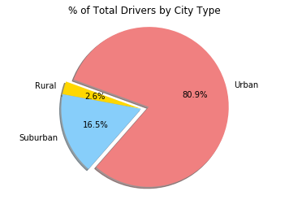

# A Taxi App Data Analysis
---

Analyzing the data for a taxi app company.


## Introduction

The ride sharing bonanza continues! Seeing the success of notable players like Uber and Lyft, you've decided to join a fledgling ride sharing company of your own. In your latest capacity, you'll be acting as Chief Data Strategist for the company. In this role, you'll be expected to offer data-backed guidance on new opportunities for market differentiation.

You've since been given access to the company's complete recordset of rides. This contains information about every active driver and historic ride, including details like city, driver count, individual fares, and city type.

Your objective is to build a **Bubble Plot** that showcases the relationship between four key variables:

- Average Fare ($) Per City
- Total Number of Rides Per City
- Total Number of Drivers Per City
- City Type (Urban, Suburban, Rural)

In addition, you will be expected to produce the following three **pie charts**:

- % of Total Fares by City Type
- % of Total Rides by City Type
- % of Total Drivers by City Type

---
## Report


The following script provides an analytical approach to the sales information of items in the Heroes of Pymoli video game store. The data was loaded from a csv, then parsed and analyzed using Python Pandas.

Click here to see the Solution Code [pyber.ipynb](pyber.ipynb).

##### Initial Code:

```python
#%matplotlib inline
# Dependencies and Setup
import matplotlib.pyplot as plt
import pandas as pd
import numpy as np

# File to Load (Remember to change these)
city_data_to_load = "Resources/city_data.csv"
ride_data_to_load = "Resources/ride_data.csv"

# Read the City and Ride Data
city_data = pd.read_csv(city_data_to_load)
ride_data = pd.read_csv(ride_data_to_load)

# Combine the data into a single dataset
city_ride_data = pd.merge(ride_data,city_data, on = 'city', how='outer')

# Display the data table for preview
city_ride_data.head()
```


|city|date|fare|ride_id|driver_count|type|
|----|----|----|-------|------------|----|
|**Lake Jonathanshire**|2018-01-14 10:14:22|13.83|5739410935873|5|Urban|
|**Lake Jonathanshire**|2018-04-07 20:51:11|31.25|4441251834598|5|Urban|
|**Lake Jonathanshire**|2018-03-09 23:45:55|19.89|2389495660448|5|Urban|
|**Lake Jonathanshire**|2018-04-07 18:09:21|24.28|7796805191168|5|Urban|
|**Lake Jonathanshire**|2018-01-02 14:14:50|13.89|424254840012|5|Urban|

---

### Bubble Plot of Ride Sharing Data

##### Data Preparation:

```python
# Data Preparation

#x is total numbers of rides per city
# y is average fare $
#colors by city tipes

ride_df = city_ride_data.groupby(['city', 'type']).agg({'ride_id': 'count', 'fare': 'mean', 'driver_count':'max'})

ride_df = ride_df.reset_index()

ride_df.columns = ['city','city_type','rides','avg_fare','driver_count']

ride_df.head()
```

##### DataFrame Output:

|city|city_type|rides|avg_fare|driver_count|
|----|---------|-----|--------|------------|
|Amandaburgh|Urban|18|24.641667|12|
|Barajasview|Urban|22|25.332273|26|
|Barronchester|Suburban|16|36.422500|11|
|Bethanyland|Suburban|18|32.956111|22|
|Bradshawfurt|Rural|10|40.064000|7|


##### Plotting:

```python

scatter_x = np.array(ride_df['rides'])
scatter_y = np.array(ride_df['avg_fare'])
group = np.array(ride_df['city_type'])
size = np.array(ride_df['driver_count'])

cdict = {'Urban': 'lightcoral', 'Suburban': 'lightskyblue', 'Rural': 'gold'}

fig, ax = plt.subplots()

for g in np.unique(group):
    ix = np.where(group == g)
    area = (10 * size[ix])

    ax.scatter(scatter_x[ix], scatter_y[ix], c = cdict[g], label = g, s = area,alpha=0.7, edgecolor='black', linewidth=1.1)
    
plt.legend(scatterpoints=1,  labelspacing=1, title='City Area')

plt.title('Ride Sharing Data (2016)')
plt.grid()
ax.set_xlabel("Total Number of Rides (Per City)")
ax.set_ylabel("Average Fare ($)")

ax.text(1.04, .75, 'Note\nCircle size correlates with driver count per city.', transform=ax.transAxes, fontsize=10)

# Save Figure
plt.savefig('Images/01_Ride_Sharing_Data.png', bbox_inches="tight")

```

##### Plot result:




---

### Total Fares by City Type

##### Data Preparation:

```python
# Calculate Type Percents

city_type_df = city_ride_data.groupby(['type']).agg({'fare': 'sum'})

city_type_df = city_type_df.reset_index()

city_type_total = city_type_df['fare'].sum()

city_type_df['percent'] = (city_type_df['fare']/city_type_total)*100

city_type_df.head()

```

##### DataFrame Output:

|type|fare_sum|percent|
|----|----|-------|
|Rural|4327.93|6.811493|
|Suburban|19356.33|30.463872|
|Urban|39854.38|62.724635|


##### Plotting:

```python
# Build Pie Chart

sizes = np.array(city_type_df['percent'])
labels = np.array(city_type_df['type'])

explode = (0, 0, 0.1) 
colors = ['gold','lightskyblue','lightcoral']
 
plt.pie(sizes, labels=labels,explode=explode, colors=colors, autopct='%.1f%%', startangle=160, shadow=True)

plt.title('% of Total Fares by City Type')
plt.axis('equal')  # Equal aspect ratio ensures that pie is drawn as a circle.
#plt.axis('scaled')
# Save Figure
plt.savefig('Images/02_Total_Fares_by_City_Type.png', bbox_inches="tight")

```

##### Plot result:




---

### Total Rides by City Type

##### Data Preparation:

```python
# Calculate Rides Percents

city_type_rides_df = city_ride_data.groupby(['type']).agg({'ride_id': 'count'})

city_type_rides_df = city_type_rides_df.reset_index()

city_type_total_rides = city_type_rides_df['ride_id'].sum()

city_type_rides_df['percent'] = (city_type_rides_df['ride_id']/city_type_total_rides)*100

city_type_rides_df.head()

```

##### DataFrame Output:

|type|rides|percent|
|----|----|-------|
|Rural|125|5.263158|
|Suburban|625|26.315789|
|Urban|1625|68.421053|


##### Plotting:

```python
# Build Pie Chart

sizes = np.array(city_type_rides_df['percent'])
labels = np.array(city_type_rides_df['type'])

explode = (0, 0, 0.1) 
colors = ['gold','lightskyblue','lightcoral']
 
plt.pie(sizes, labels=labels,explode=explode, colors=colors, autopct='%.1f%%', startangle=160, shadow=True)

plt.title('% of Total Rides by City Type')

plt.axis('equal')  # Equal aspect ratio ensures that pie is drawn as a circle.
#plt.axis('scaled')

plt.savefig('Images/03_Total_Rides_by_City_Type.png', bbox_inches="tight")

```

##### Plot result:




---

### Total Drivers by City Type

##### Data Preparation:

```python
# Calculate Driver Percents

city_data

city_type_drivers_df = city_data.groupby(['type']).agg({'driver_count': 'sum'})

city_type_drivers_df = city_type_drivers_df.reset_index()

city_type_total_drivers = city_type_drivers_df['driver_count'].sum()

city_type_drivers_df['percent'] = (city_type_drivers_df['driver_count']/city_type_total_drivers)*100

city_type_drivers_df.head()

```

##### DataFrame Output:

|type|driver_count|percent|
|----|----|-------|
|Rural|78|2.623613|
|Suburban|490|16.481668|
|Urban|2405|80.894719|


##### Plotting:

```python
# Build Pie Chart

sizes = np.array(city_type_drivers_df['percent'])
labels = np.array(city_type_drivers_df['type'])

explode = (0, 0, 0.1) 
colors = ['gold','lightskyblue','lightcoral']
 
plt.pie(sizes, labels=labels,explode=explode, colors=colors, autopct='%.1f%%', startangle=160, shadow=True)

plt.title('% of Total Drivers by City Type')

plt.axis('equal')  # Equal aspect ratio ensures that pie is drawn as a circle.
#plt.axis('scaled')

# Save Figure
plt.savefig('Images/04_Total_Drivers_by_City_Type.png', bbox_inches="tight")

```

##### Plot result:



---

## Conclusions

Based on our analysis, the following conclusions can be established:

* It is clear that the Taxi app is way more used in cities. This might be because 1) it is really known that Urban areas hold a higher population by squared feet, but also 2) it turns out that Urban areas hold 80.9% of total drivers on the app.

* The higher offer on drivers in Urban areas make that the prices of trips drop and it creates a cycle effect: lower prices / more users using it because it is cheap / more drivers because they have service demand.

* Increasing the drivers on Suburban areas might be beneficial to the business because it seems that there is a market there that is willing to pay more for trips, however there are only 16.5% of drivers on Suburban areas.